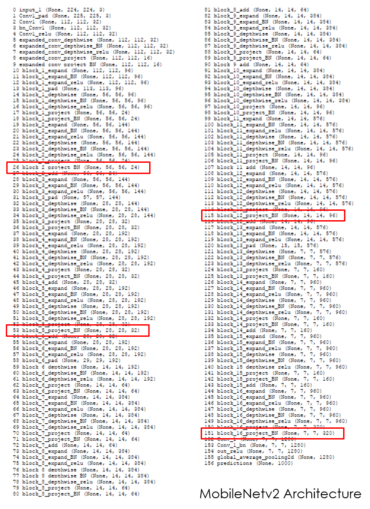
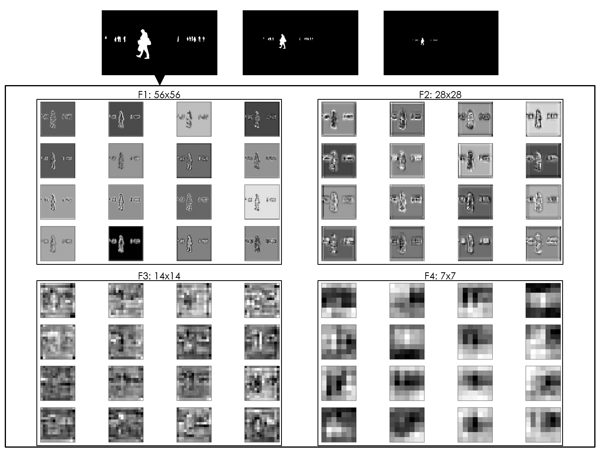
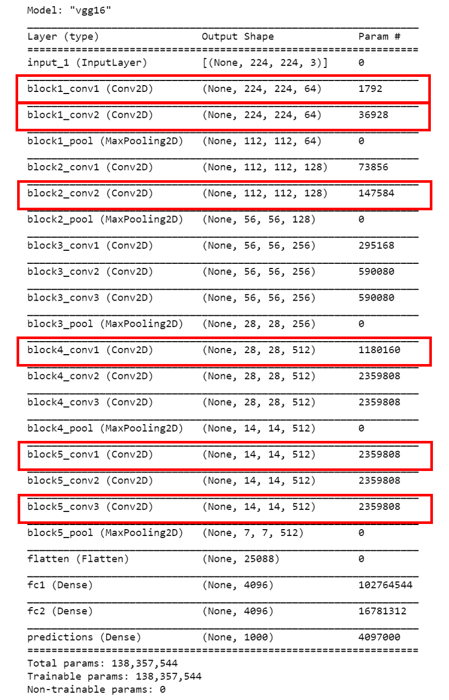
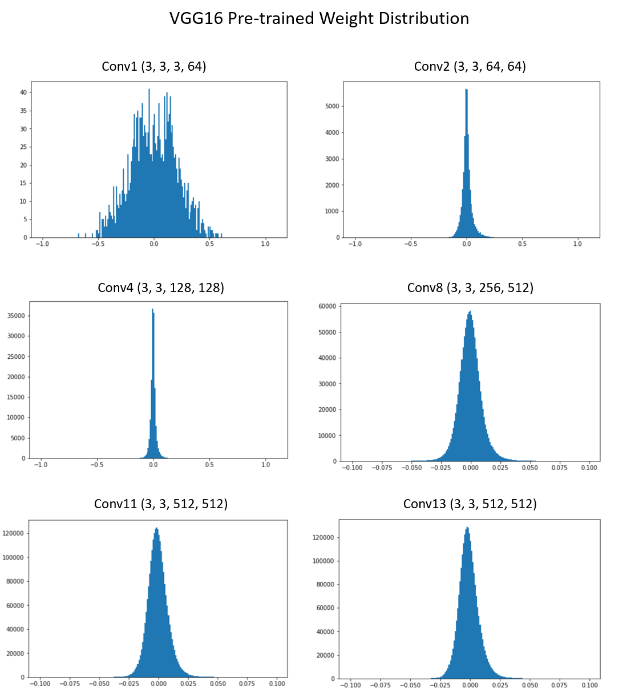

# CNNs-Analysis: To know what happens inside Convolutional Neural Networks!

## 1. Feature Maps Visualization
### 1.1 MobileNetv2 Architecture

### 1.2 MobileNetv2 Feature Maps Visualization

## 2. Pre-trained Weight Distribution
### 2.1 VGG16 Architecture

### 2.2 VGG16 Weight Distribution

Le-Anh Tran

Yongin 08/2020
